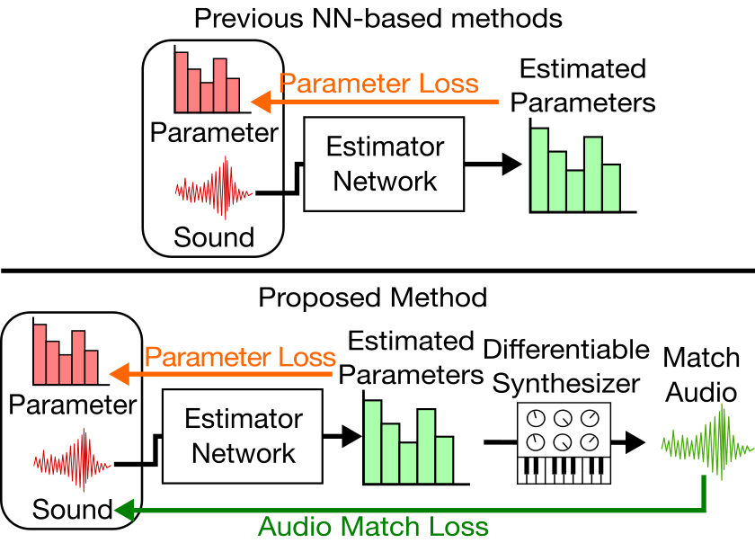
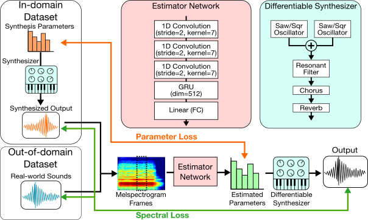

# Accompanying Website for Semi-supervised Synthesizer Sound Matching with Differentiable DSP

## Summary

While synthesizers have become commonplace in music production, many users find it difficult to control the parameters of a synthesizer to create the intended sound. In order to assist the user, the *sound matching* task aims to estimate synthesis parameters that produce a sound closest to the query sound.

In recent years, neural networks have been employed for this task. These neural networks are trained on paired data of synthesis parameters and the corresponding output sound, optimizing a loss of synthesis parameters. However, synthesis parameters are only indirectly correlated with the audio output. Another problem is that query made by the user usually consists of real-world sounds, different from the synthesizer output used during training.

The proposed method implements a typical subtractive synthesizer using differentiable DSP modules. We can use this differentiable synthesizer during training to obtain a spectral loss of the actual synthesized sound and the target sound. We find that this is advantageous to using parameter loss for two reasons:
- The spectral loss is more directly related to the output of the system.
- We can train the network using out-of-domain (real-world) sounds, whose ground-truth synthesis parameters are unknown and cannot be trained using parameter loss.

### Differences from ISMIR2021 paper

- Differentiable ADSR envelopes
- Effect modules
  - Chorus
  - Reverb
- Analysis of parameter gradients
- + More experiments for to shed light on the difficulties in sound matching

## Audio Examples

TODO:
